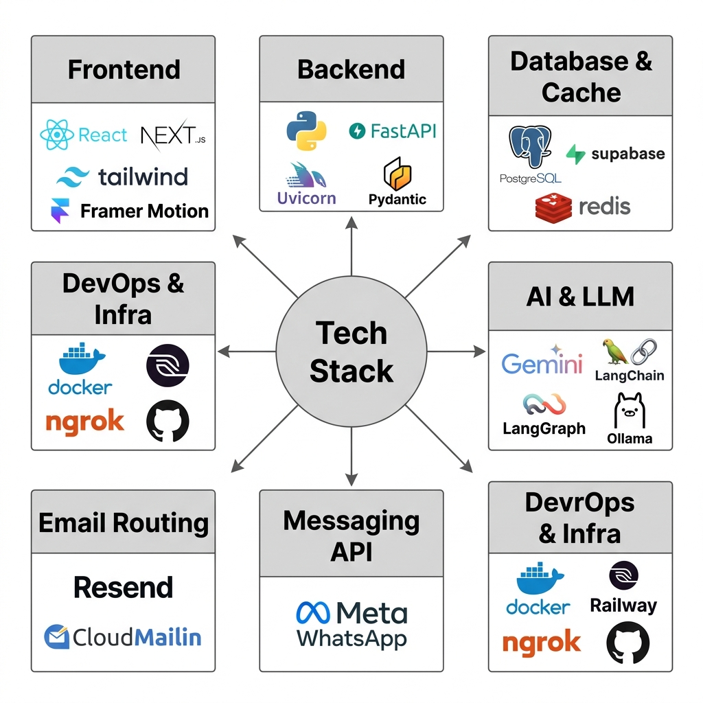
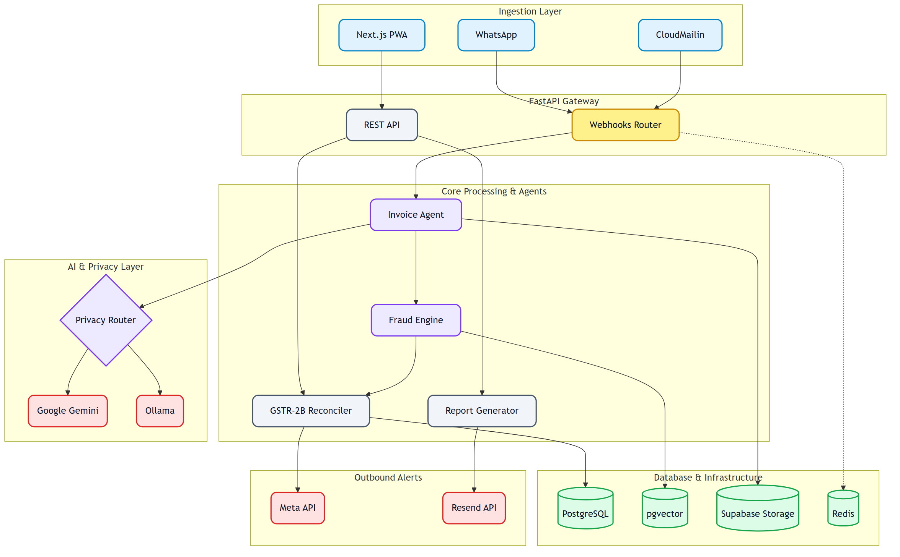

# Munim.ai

**WhatsApp-first GST compliance co-pilot for Indian MSMEs**


> Traders forward invoices via WhatsApp. Munim extracts, validates, fraud-checks, and reconciles them automatically. CAs get a clean action-driven dashboard instead of a pile of paper.

---

## Core USPs

### 1. WhatsApp-First — Zero App Download
- Traders interact entirely via WhatsApp in their language (Hindi, English, Marathi, Gujarati)
- Conversational onboarding in under 2 minutes
- Each trader gets a dedicated Munim email address for vendors who prefer email over WhatsApp

### 2. Multimodal AI Extraction (Gemini 2.5 Flash)
- Handles crumpled thermal receipts, handwritten bills, scanned PDFs, blurry photos
- Outputs structured JSON: supplier name, GSTIN, invoice number, date, line items, HSN codes, tax breakdown
- Low-confidence extractions are flagged for human review

### 3. Deterministic ITC Rules Engine — No LLM
- Pure rule-based GST Act §16 + §17(5) implementation
- Classifies every invoice into: `CONFIRMED` / `FIXABLE_BLOCKED` / `AT_RISK` / `INELIGIBLE` / `FRAUD_FLAGGED`
- 12+ blocked categories covered by HSN prefix and keyword matching (motor vehicles, accommodation, outdoor catering, health clubs, personal consumption, real estate, etc.)
- Zero hallucination risk — fully auditable logic

### 4. 6-Signal Fraud Scoring Engine (0–100)

| Signal | What It Detects |
|---|---|
| GSTIN Age | New GSTIN (<180 days) issuing high-value invoices |
| Benford's Law | Unnatural leading-digit distribution (chi-squared test) |
| Sequential Invoice Numbers | Consecutive serials from same supplier — classic fake invoice pattern |
| Business Type Mismatch | GSTIN registration category contradicts invoice line items |
| Geographic Mismatch | Supplier state ≠ buyer state without IGST |
| Velocity Anomaly | Invoice amount >5× the supplier's historical average |

Score ≥ 70 → `FRAUD_FLAGGED`. Score 40–69 → soft flag for CA review.

### 5. GSTR-2B Three-Pass Fuzzy Reconciliation
- **Pass 1 — Exact:** GSTIN + invoice number + date all match
- **Pass 2 — Fuzzy:** Levenshtein distance on invoice number (`INV-001` vs `INV001`), ±2% amount tolerance, ±15-day date window
- **Pass 3 — Amount + Date:** Fallback when invoice number is ambiguous
- Unmatched invoices surface instantly in Action Queue with vendor contact options

### 6. Prioritized Action Queue
- All issues across all clients ranked: fraud flags → ITC-at-risk → fixable blocks
- Each item shows the exact reason, affected tax amount, and recommended fix
- One-click WhatsApp or email vendor warning sent directly from the dashboard

### 7. Supplier Health Monitoring
- Tracks each vendor's GSTR-1 filing consistency across months
- Flags chronically non-compliant suppliers before they become a problem

### 8. Email Invoice Ingestion (Cloudmailin)
- Traders share their dedicated Munim email with vendors
- Vendor emails PDFs → Cloudmailin webhook → same Gemini pipeline → auto-added to records

### 9. Auto-Generated Compliance Reports
- One-click PDF per trader per period
- Covers ITC summary, blocked amounts, at-risk credits, reconciliation status, supplier health

### 10. GST Portal Simulation
- Interactive IMS (Invoice Management System) + GSTR-3B auto-draft
- Populated from live backend data — context-aware per selected trader
- Mirrors the real GST portal UI for demo and training purposes

### 11. Real-Time Compliance Timeline
- Visual deadline calendar: GSTR-1, GSTR-2B upload, GSTR-3B filing dates
- Proactive WhatsApp reminders before each deadline

### 12. Multi-Tenant CA Dashboard
- One CA manages unlimited traders from a single login
- Instant client switching, fully isolated per trader data
- Built as a PWA — works on mobile without installation

---

## Tech Stack



| Layer | Technology |
|---|---|
| Backend | FastAPI, LangGraph, Python 3.12, Uvicorn |
| Frontend | Next.js 14 (App Router, Turbopack), Tailwind CSS |
| Database | Supabase (PostgreSQL + Row Level Security) |
| AI / LLM | Google Gemini 2.5 Flash (Vision + Text) |
| Messaging | Meta WhatsApp Cloud API |
| Email Ingestion | Cloudmailin |
| Cache / Sessions | Redis (Upstash) |
| GSTIN Validation | deepvue.tech API |
| Fuzzy Matching | python-Levenshtein |
| PDF Generation | WeasyPrint |
| Deployment | Railway (backend) + Vercel (frontend) |

---

## Architecture



```
Trader (WhatsApp / Email)
         │
         ▼
Meta Cloud API / Cloudmailin Webhook
         │
         ▼
FastAPI Backend (Railway)
         │
    LangGraph Pipeline
    ├── 1. Gemini Vision OCR → InvoiceJSON
    ├── 2. GSTIN Validator (deepvue.tech)
    ├── 3. HSN Validator (pgvector + Supabase)
    ├── 4. ITC Rules Engine   ← no LLM
    ├── 5. Fraud Scorer       ← no LLM
    └── 6. GSTR-2B Reconciler ← no LLM
         │
         ▼
Supabase PostgreSQL
    ├── CA Dashboard (Next.js / Vercel)
    │     ├── Action Queue
    │     ├── Supplier Health
    │     ├── ITC Timeline Chart
    │     ├── Reports Panel
    │     └── GST Simulation
    └── Redis (session state / conversation context)
```

---

## Project Structure

```
munim-ai/
├── backend/
│   ├── app/
│   │   ├── api/
│   │   │   ├── webhook.py          # WhatsApp bot + onboarding
│   │   │   ├── dashboard.py        # CA dashboard endpoints
│   │   │   ├── gstr2b.py           # GSTR-2B upload + reconciliation
│   │   │   ├── reports.py          # PDF generation
│   │   │   ├── communications.py   # Vendor WhatsApp/email warnings
│   │   │   ├── email_webhook.py    # Cloudmailin ingestion
│   │   │   └── auth.py             # JWT auth
│   │   ├── domain/
│   │   │   ├── itc_engine.py       # GST §16/§17(5) rules
│   │   │   ├── fraud.py            # 6-signal fraud scorer
│   │   │   ├── reconciler.py       # 3-pass GSTR-2B reconciler
│   │   │   ├── hsn.py              # HSN validator
│   │   │   └── supplier_monitor.py # Supplier health scoring
│   │   ├── models/                 # Pydantic data models
│   │   └── services/               # Supabase, WhatsApp, Gemini clients
│   ├── schema.sql
│   └── requirements.txt
├── frontend/
│   ├── src/app/
│   │   ├── dashboard/              # CA main dashboard
│   │   ├── trader/                 # Trader PWA
│   │   └── components/             # Shared UI components
│   └── public/demo/                # GST simulation (standalone HTML/JS)
└── demo/                           # Symlinked for direct serving
```

---

## API Reference

| Endpoint | Method | Description |
|---|---|---|
| `/api/v1/webhook` | GET/POST | WhatsApp webhook (verify + message handling) |
| `/api/v1/webhook/upload-invoice` | POST | Direct upload from Trader PWA |
| `/api/v1/email-webhook` | POST | Cloudmailin inbound email → pipeline |
| `/api/v1/dashboard/summary/{trader_id}` | GET | ITC summary card data |
| `/api/v1/dashboard/actions/{trader_id}` | GET | Prioritized action queue |
| `/api/v1/dashboard/actions/{id}/resolve` | PATCH | Mark action resolved |
| `/api/v1/dashboard/suppliers/{trader_id}` | GET | Supplier health list |
| `/api/v1/dashboard/invoices/{trader_id}` | GET | Invoice records + filters |
| `/api/v1/dashboard/itc-timeline/{trader_id}` | GET | 6-month ITC chart data |
| `/api/v1/dashboard/reports/generate/{trader_id}` | POST | Generate PDF report |
| `/api/v1/gstr2b/upload-file/{trader_id}` | POST | Upload GSTR-2B JSON |
| `/api/v1/gstr2b/reconcile/{trader_id}` | POST | Trigger reconciliation run |
| `/api/v1/gstr2b/records/{trader_id}` | GET | Fetch GSTR-2B records |

---

## Getting Started

### Prerequisites
- Python 3.12+, Node.js 18+, Supabase project, Gemini API key, Redis, Meta WhatsApp credentials

### Backend
```bash
cd backend
cp .env.example .env   # Fill: GEMINI_API_KEY, SUPABASE_URL, SUPABASE_SERVICE_KEY,
                        #       REDIS_URL, META_ACCESS_TOKEN, META_PHONE_NUMBER_ID,
                        #       CLOUDMAILIN_SECRET, DEEPVUE_API_KEY
pip install -r requirements.txt
uvicorn app.main:app --reload
# OR: docker-compose up -d
```

### Frontend
```bash
cd frontend
cp .env.local.example .env.local   # Set NEXT_PUBLIC_API_URL=http://localhost:8000
npm install && npm run dev
```

- CA Dashboard → `http://localhost:3000/dashboard`
- Trader PWA → `http://localhost:3000/trader`
- GST Simulation → `http://localhost:3000/demo`

### Database
Run `backend/schema.sql` in your Supabase SQL editor.

---

## Production Deployment

### Backend → Railway
1. New Project → Deploy from GitHub → Root Directory: `backend/`
2. Add Redis from Railway marketplace
3. Set all env vars in Railway → Variables
4. Auto-deploys on every push to `main`

### Frontend → Vercel
1. New Project → Import repo → Root Directory: `frontend/`
2. Add env var: `NEXT_PUBLIC_API_URL=https://your-railway-app.up.railway.app`

### WhatsApp Webhook
- URL: `https://your-backend.up.railway.app/api/v1/webhook`
- Verify Token: set in `.env`
- Subscribe to: `messages`

---

*© 2026 Abhishek Saraf. All rights reserved. See LICENSE.*
